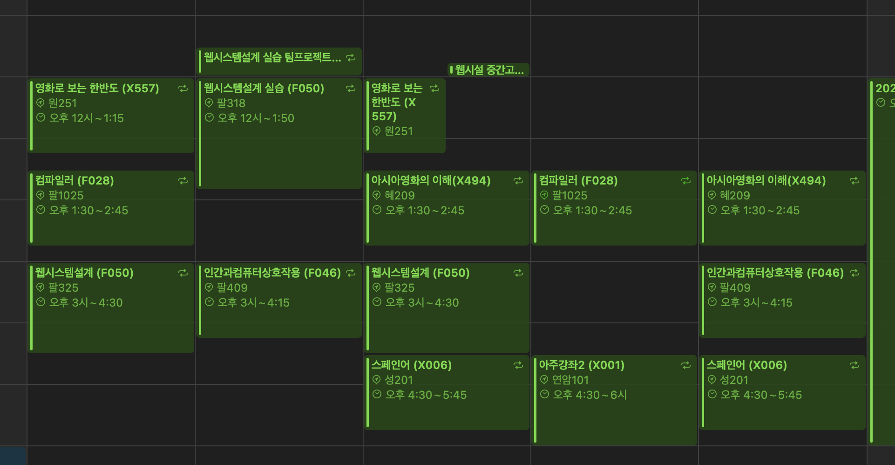

다사다난했던 2024년이 저물고 있다…

### 산업기능요원 소집해제 & 퇴사

올해 가장 큰 사건이다. 23개월간의 산업기능요원 복무가 소집해제되어 드디어 민간인이 되었다 (2022년 6월~ 2024년 5월). 소집해제후 복학까지 시간이 3개월정도 비었는데, 마무리 짓고 싶은 일들이 남아있어 퇴사를 미루고 미뤄 약 2개월정도 더 근무하고 퇴사하게 되었다.

회사 다닐때는 내가 n개월차 개발자 만큼 실력이 있나?하는 질문을 스스로 한테 계속 던졌고, 그래서 많이 조급해 했었다. 퇴사한지 몇개월이 지난 지금 시점에서 봤을때는… 굳이 그렇게 급했어야 했을까 싶긴하다. 회사에 재직하는동안 기술적으로도 많은 성장을 이루었다고 생각하지만, 이 회사에서 재직하는 동안 배울 수 었었던 가장 큰 점은 직접적인 개발 외에 개발자에게 필요한 역량이라고 생각된다. 정확히 말하면 단순한 코딩을 넘어 좋은 제품을 만들기 위해 필요한 행위—문서화, 타협, 설득, 제안, 때로는 투쟁—들의 필요에 대한 이해가 생겼다. PS를 통해 너무 단순한 상황만 접해봐서일지 모르겠지만, 그 당시 나에게는 너무나도 어려운 개념들이였다. PS에서는 문제 지문, 제한 시간, 제한 메모리를 제공받고 문제를 해결하는 반면에 실무에서는 차마 문서화할 수 없는 다양한 요소들도 모두 고려해야한다. 마감일자, 구현해야하는 기능을 넘어 고객의 기대치, 내 일정, 협업하는 다른사람의 일정, 작업이 필요한 코드 베이스, 배포 일정, 사업의 흐름등 총체적인 요소들을 고려해서 어떻게 작업할지 계획하고 작업해야한다. 처음에는 이러한 요소들을 고려하기 보다는 내 앞마당(코드 베이스)를 가꾸는 작업에 더 집중했었던 것 같은데, 어느 순간 저런 총체적인 개발활동도 앞마당 가꾸기 만큼이나 예술(?)적임을 느꼈다. 앞으로는 두마리 토끼를 모두 잡을 수 있는 그런 개발자가 되고 싶다는 생각이 든다.

힘든때도 있었지만 멋진 동료분들과 함께 일할 수 있어서 어디 가서 쉽게할 수 없는 좋은 경험들을 많이 할 수 있었다. 감사했습니다.

### 복학 & 학교생활

무려 2년 반만에 돌아온 학교인데, 20~21년은 코로나로 인한 비대면 수업이 진행되던 시즌이라 오프라인 학교 복귀는 4년 반만이다. 아무튼 신입생의 마음으로(?) 학교에 복학하게 되었다. 회사생활 2년하면서 학교수업에 대한 갈증이 조금씩 자라나고 있었는데(진작에 잘하지…), 생각보다 학생으로 사는것도 쉽지 않구나 하는 것을 상기시켜준 한 학기 되시겠다. 다음은 내가 들은 수업들이다 (총 20학점):

- 웹시스템설계: 실무하면서 알게 되었던 웹 관련 지식들을 다시 톺아보기 위해 수강했다. 팀프로젝트를 제외하면 만족도가 정말 높은 과목이다. 예를 들어서 실무 개발을 하면서 개발 문서에 자주 접할 수 있는 expression 과 statement 용어에 대한 차이가 무엇인지 생각해보기가 쉽지 않은데, 정말 웹 기술의 fundamental을 튼튼하게 할 수 있었다. 팀프로젝트는 음… 이다.
- 인간과컴퓨터상호작용: 회사를 다니면서 UI/UX에 대한 고민을 정말 많이 했었는데, 내 UI/UX 원칙을 조금 더 체계적으로 다져보고 싶어 수강했다. 한학기 동안 수강해보니 처음 수강목적에 부합하는 그런 과목은 아니였지만 HCI 에 대한 다양한 내용을 얕게 훑을 수 있었다. 수업 도중 한번 진행되었던 실무자 특강은 매우 유용했다.
- 컴파일러: CS를 공부하는 학생이라면 어떻게 소스코드가 기계어로 번역되는지, 블랙박스와 같은 컴파일러 안을 한번 들여다 보고 싶다는 생각을 하게 된다. 그런 필요로 인해 수강한 과목이다. 다만 학기가 syntax tree 를 구성하는 단계에서 끝나버려서 아쉬움이 남았다. 다만 이전에 들었던 계산이론의 오토마타 내용이 실제로 어떻게 연계되어 응용되고 있는지를 살펴볼 수 있었던 것은 좋았다.
- 영화로보는한반도: 단순히 영화가 좋아서 수강했던 과목이다. 한반도 문제는… 솔직히 말하면 관심이 없다. 김기덕 감독의 <그물>이 수업 도중 나왔는데 재밌게 봤다. 교양과목이라 그런지 깊이 있는 영화 해제는 진행되지 않는다.
- 아시아영화의이해: 이전에 수강했던 서양영화사를 너무 재밌게 들어서 같은 교수님의 수업을 수강하게 되었다. 이번 학기 수업중 가장 흥미로웠던 수업인데, 주류인 할리우드와 유럽 영화에 맞서 아시아 영화만이 가지는 고유한 가치는 무엇이고 영화를 어떻게 비판적으로 바라봐야하는지에 대한 내용이 한 학기동안 다루어진다. 한학기동안 10편이 넘는 영화를 시청해야 수업을 따라갈 수 있지만 그만큼 영화에 대한 식견을 넓힐 수 있는 값진 과목이다. 수업에서 다루어졌지만 아직 시청하지 않은 영화들을 볼 생각에 아직도 기대가 된다. 아마 다음학기에는 같은 교수님의 한국영화사를 수강하게 될 것 같다.
- Español: Para prepararme para el viaje familiar a España que haré a finales de año y principios del próximo, tomé un curso de español. Aunque el orden de las palabras es casi igual al del inglés y no fue tan difícil, lidiar con los sustantivos que cambian según el género y el número, así como con los adjetivos que varían dependiendo de esos sustantivos, me mareaba un poco. A pesar de eso, fue una buena clase en la que pude sentir la calidez (¿humanista?) de la facultad de humanidades gracias a un profesor amable que prestaba atención a cada estudiante. Además, creo que ahora (probablemente) podré hacer saludos básicos o pedir comida cuando esté en España. (Gracias ChatGPT.)
- 아주강좌: 1학점짜리 아주대 공식 꿀 교양이다. 그런데 매번 500자 감상문을 작성하는것이 너무 번거로워서 그다지 꿀은 아닌것 같다. 강연 퀄리티는 매주 연사가 달라지다보니 복불복이였다.

그리고 A.N.S.I. 소학회 활동도 다시 참여했다. 기초 알고리즘 스터디 강의도 한번 진행했고(너무 오랫만이라 많이 절었다), 내 첫 오프라인 후배(?)들도 만나고… 재밌었다.

### ICPC

2학기에 복학을 해야만했던 가장 큰 이유다. 7월 중순에 퇴사한뒤 ICPC 참가를 위해 열심히 재활을 했다. 학교에서 실력 좋고 마음이 맞는 팀원 두명과 MeatInTheMiddle이라는 팀을 만들어 총 2개의 리저널에 참여했다. 결론부터 말하면 결과는 만족스럽지 못하다.

- 개인적으로 서울리저널은 나름 고점을 찍었던 것 같긴하다. 다만 팀적으로 패널티 관리에 실패했고 올해부터 본선 진출 조건이 변경되어서 실력좋은 서울대 & 카이스트팀들이 많이 올라와 역대 최고 기록인 5솔브를 기록했음에도 불구하고 등수는 낮게 나왔다. 사람들이 너무 잘하는 것 같음.
- 자카르타 리저널은 내 실수로 거하게 말아먹었다. 문제 제한 조건을 활용해서 쉽게 푸는 방법이 있었음에도 불구하고 어려운 풀이에 갇혀있었고, 그래서 한문제를 해결하는데 너무 오랜 시간을 사용했다. 모든 연습+실전셋 통틀어서 최저점을 보여준 것 같다…

고점과 저점을 한 해에… 역시 실전대회는 아무도 모르는 것 같다.

그래도 팀연습 매주 1~2셋씩 진행하고 합도 맞춰보는 과정에서 내가 잘하는 것(의외로 애드혹?)과 못하는 것(웰노운 자료구조 구현…)이 무엇인지 파악하게 되었고, 재미있었다. 의미있었던 도전이라고 생각한다. 아직 ICPC 를 더 참여할 예정인 팀원들은 내년에 좋은 결과 있었으면 좋겠다. 화이팅!

ICPC 와 별개로 Codeforces 같은 대회는 계속 참여할 예정이다.

### 기타

큰 사건은 아니지만 24년에 나에게 생긴 변화들이다.

- 캘린더 사용: 회사에서 사용하던 것이 그대로 습관이 되어서 캘린더를 적극 활용하게 되었다. 더군다나 iOS 18 & macOS Sequoia 업데이트 이후로 캘린더와 미리알림 앱이 통합되어서 사용성이 아주아주 많이 개선되어 사용하기 정말 좋아졌다. 사소한 일도 까먹지 않으려고 모두 캘린더에 등록하고 여유 있을때마다 작업 일정을 조율해본다. 예전에는 얼마나 무계획적으로 살았던 것일까… (TMI: 지금 회고록 작성도 약 2주전에 등록된 미리알림중 하나이다.)
- Letterboxd 사용: 사실 23년도 부터 활동하고 있었으나 본격적으로 영화에 별점을 부여하고 한줄평을 남기기 시작한 것은 올해라서 기록해본다. 요즘 좋은 영화란 무엇인가 고민을 많이 하고 있다. 자연스럽게 영화를 어떻게 평가하는 것이 좋을지에 대한 고민도 많이 한다. 아직 기록상 영화를 300편도 시청하지 않은 영린이라서 다양한 영화를 보는것이 중요할 것 같긴한데, 영화 몇개에 별점을 부여하다보니 나름의 내 영화 취향이 보이는 것 같긴 하다. 확실하게 내 생각이 정리되는 영화(보통 실망스러운 영화들)에 대해서는 내 생각을 [Letterboxd](https://letterboxd.com/SylvesterKwon/)에 한줄평으로 남기고 있다.
- 카메라 구입: 퇴사 후 스스로에게 하는 선물로 카메라(Sony A7C2 + SEL2860)를 선택했다. 솔직히 말하면 폰카도 자주사용하는 편은 아니였지만 길거리를 돌아다니면서 보이는 풍경 하나하나를 좋은 품질의 사진으로 찍어서 잘 간직하고 싶다는 생각을 예전부터 했어서 구매를 결심하게 되었다. (써놓고보니 장비병인것 같긴하다. 어쩔건데!!!) 사진 잘 연습해서 많은 사람들에게 울림을 줄 수 있는… 그런 사진을 찍고싶다.