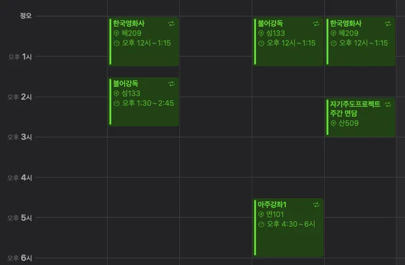

2024년 회고를 작성한지가 엊그제 같은데, 벌써 2025년의 상반기가 끝나간다. 

### 스페인 여행

2024년 끝자락에 스페인으로 가족여행을 떠났다. 약 10일간 여행했고, 새해도 스페인에서 맞이했다. 마드리드, 세비야, 그라나다, 바르셀로나를 방문했다. 가서 가장 크게 느낀 것은, 예전과 다르게 유럽도 경쟁사회화가 되면서 시에스타나 몇시간에 걸친 점심식사등, 사람들의 여유로움이 많이 사라졌다고 하는데, 그래도 여전히 그들에게는 우리나라 사람들에게서 찾아볼 수 없는 여유로움이 나한테 느껴졌다. 세비야 아메리카 광장 밴치에 앉아서 새 모이를 주는 사람, 바르셀로나 바르셀로네타 해변에서 혼자 일광욕을 즐기던 사람, … 세비야 누에보 광장에 새해맞이를 위해 나가 있을때 인상 좋아보이는 스페인 사람 무리들이 나에게 샴페인을 권해 받은 기억은 아직도 잊지 못하겠다.

나는 항상 “해야 할 일”을 생각하면서 실제 일을 하며 겪어야 할 감정 소모보다, 그것을 해야 함에 얻는 스트레스가 더 컸던 것 같다, 반면 그들은 지금, 현재를 누릴줄 아는 것 같아 보여서 배울 점이 있다고 생각했다. 인터넷이나 책으로만 보던 여러 유적을 보는 것도 흥미로운 일이였지만, 아마 이 점이 올해 스페인 여행에서 얻었던 가장 큰 소득인 것 같다.

지금 되돌아보니 꿈과도 같은 시간이였다.

(여행중에도 하루 여행 일정이 끝나면 피곤해도 꼭 여행 일지를 써서 남겨두었는데, 언젠가 블로그에 올려보고 싶다.)

### 마지막 학기

졸업을 하기 위해 아직 10학점 정도를 마저 채워야했다. 이번 학기에 수강했던 과목들의 수강평이다:

- 불어강독: 지난 학기에 스페인어를 배웠고, 스페인 여행에서 어느정도 유용했었다. 배우는 과정도 정말 재밌었다. 스페인어를 강의해주셨던 교수님이 불어불문과 소속이셔서, 수업 중간 중간에 프랑스어에 대한 내용도 알려주셨고, 자연스럽게 프랑스어도 배워보고 싶다는 생각도 하게 되었다. 그래서 교수님의 추천으로 불어강독 과목을 수강하게 되었다. 프랑스어는 확실히 스페인어보다는 어려운 것 같다. 일단 발음부터 난관이였다. 그놈의 [ʀ] 소리가 정말 발음하기 힘들더라… 스페인어와 같은 인도유럽어족의 로망스어군 언어라 문법은 어느정도 공유되는 점, 그리고 어휘 유사성이 어느정도 있어서 비교하면서 배우는 재미가 있었다. 교수님도 수업시간에 다른 여러 언어들과 비교해주셔서 재밌게 수강할 수 있었다.
- 아주강좌1: 지난학기와 마찬가지로 1학점을 채우기 위해 수강했다. “노랫말에 담긴 시대정신” 이라는 주제로 열렸던 강연은 기억에 남는다. 밥 딜런의 “Blowin’ in the Wind” 나, 산울림의 “너의 의미”와 같은 노래들을 무려 라이브로 연주해주시며 가사 풀이를 해주셨다. 노래 가사 보는 것을 정말 좋아하는 나한테는 흥미로운 강의였다.
- 한국영화사: 이전에 수강했던 2개의 영화 관련 과목의 교수님이 진행하시는 또 다른 과목인 “한국영화사”를 수강했다. 마지막 학기인데, 수강 신청에 실패하면 다시는 들을 길이 없다는 생각에 수강신청할때 최우선으로 담았던 기억이 난다. 코로나 시절에 비대면으로 수강했었던 “서양영화사”는 영화를 발명했던 서양 세계에서 영화가 어떻게 발전했는지에 대해서 배웠고, 지난학기에 수강했던 “아시아영화의이해”에서는 영화 종주국은 아니지만 이웃 국가들에서는 영화가 어떤 다른 양상을 보이며 발전했는지, 어떤 고유한 가치를 지니는 지에 대해 배웠다. 그리고 “한국영화사”에서는 우리에게 익숙한 한국사에 맞춰 영화가 어떻게 발전했는지에 대해서 배울 수 있었다. 1919년 최초의 한국 영화 <의리적 구토> 에서 2019년 세계적인 대 히트작 <기생충>까지의 100년에 걸친 영화의 역사와, 2020년대 포스트 코로나 시대에 한국 영화가 어떤 길을 걷고 있는지 알아봤다. 영화를 그냥 보는 것도 재밌지만, 어떤 영화가 어떤 시대적인 배경에 영향을 받아 나오게 되었는지 분석하면서 보는 것은 영화 감상에 깊이를 한층 더해준다. 이 강의들로 바뀐 “영화를 대하는 법”은 대학에서 얻어가는 최고의 자산 중 하나로 남게 될 것 같다.
- 자기주도프로젝트: 과 졸업요건을 채우기 위함도 있고, 해보고 싶던 웹 프로젝트가 있어 수강하게 되었다. 강의는 따로 열리지 않고 한학기동안 말 그대로 하고 싶은 주제로 프로젝트를 진행하면서 주간 보고서, 최종 보고서를 작성하고 제출하면 되는 과목이다. 나는 경쟁적 프로그래밍 플랫폼들의 문제 및 콘테스트 정보를 통합해서 조회할 수 있고, 관련해서 풀이를 나눌 수 있는 cphub라는 서비스를 만들었다. 즐겨 사용하는 영화 관람평 등록 사이트 letterboxd를 밴치마킹해서 만들었다. 이 과목을 수강하기 위해서는 프로젝트를 지도해줄 지도교수님이 필요한데, 지도교수님이 주간 회의때 재밌는 아이디어도 많이 주셔서 작업하는 과정 자체가 너무 즐거웠다. 회사에서 하는 일과 다르게 기획부터 배포까지 직접 해볼 수 있어서 그 경험 자체가 값진 것 같다. 제작했던 서비스 개발기는 조만간 다른 글로 정리해서 올릴 예정이다.

이것 외에도 소학회에서 진행하는 기초 알고리즘 스터디에 격주로 강의자로 참여하기도 했고, 2023년에 내가 수상했던 APC(아주대 프로그래밍 경시대회)의 출제진으로 참여해서 3문제나 출제했다. 출제 관련 내용은 마찬가지로 다른 글로 정리할 예정이다.

마지막 학기라는 점에 아쉬움이 많이 남는다. 학교를 8학기나 다녔는데, 다닐때는 아무 생각이 없었지만 막상 졸업할때 되니까 다시는 할 수 없을 멋진 시기를 보냈음을 깨닫게 된다. 비록 코로나 때문에 반토막짜리 대학생활을 하게 되어서 아쉬움도 남지만 말이다.

### 취준

아련하게 학교 생활을 마무리하는 것과는 별개로 아무래도 마지막 학기라서, 취준을 시작하게 되었다. 결과부터 말하면 이번 학기에는 4개 회사에 지원했지만, 아쉽게도 좋은 결과를 받아 볼 수 없었다. 아무래도 학교를 다니면서 동시에 준비하는 것이 쉽지 않았다. 특히 과제전형 수행에 있어서 시간 투자에 많은 어려움을 겪었다. 그래서 졸업은 한학기 유예하고 2025년 하반기는 취준에 힘을 쏟을 예정이다.

예전과는 다르게 정말 채용시장이, 특히 개발자 채용시장이 안좋은 것을 지금 몸으로 느끼고 있다. 사실 예전에 IT호황일때 많은 사람들이 취직에 크게 어려움을 느끼지 않는 것을 보고 취준에 대해 별 두려움을 못느끼고 있었는데, 정말 1년 1년 시장이 급변하게 변하고 있는 것을 느낀다.

그래도 나는 개발이 아직은 너무 재밌다. 이 일이 아니면 안될 것 같다는 생각이다. 이제 풀타임 취준생(?)의 신분으로 내가 대 AI시대에서 개발자로 줄 수 있는 가치가 뭔지, 하고 싶은일이 뭔지를 찬찬히 생각하면서 하반기 취준을 준비해야겠다. 지금부터 CS복습도 하고, 면접 준비도 잘 준비하면 어려운 채용시장에서도 곧 내 자리를 찾을 수 있지 않을까 하는 아주 조금은 낙관적인 생각을 해본다.