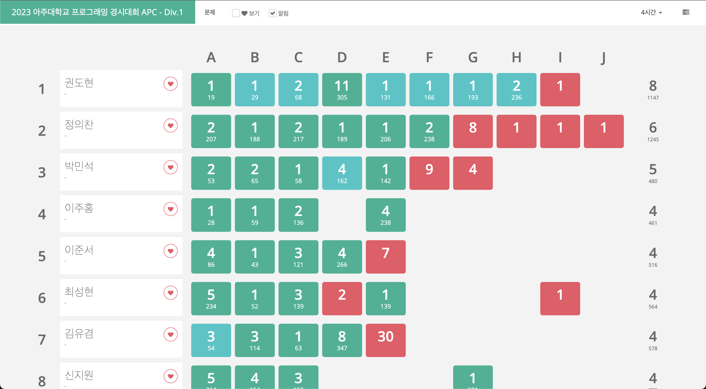

## APC 2023
[2023 아주대학교 프로그래밍 경시대회](https://shake.codes/apc)(이하 APC)에 휴학생의 신분으로 참여하였다. APC는 [경인지역 6개대학 연합 프로그래밍 경시대회](https://shake.codes/)(이하 shake!) 의 아주대학교 대표 선발전을 겸한다. 2020년부터 문제풀이를 시작했었는데, 코로나등등의 사유로 인해 이번 APC로 오프라인 대회를 처음으로 경험하게 되었다. 해결했던 문제들에 대한 해설과 개인적인 감상을 기록해두고 싶어 오랜만에 포스트를 작성한다.

## [A. 2023 아주머학교 프로그래딩 정시머힌](https://www.acmicpc.net/problem/28125)
00:19, 1 제출

문제에서 주어진대로 수정본을 다시 원본으로 변경하면 된다. 다만, `\'` 에서 `v`, `\\'` 에서 `w` 로의 변환은 다른 케이스와는 다르게 복수개의 문자가 단일 문자로 치환되어야 하는 케이스이므로 예외처리가 필요하다. 또한 사용하는 언어에 따라서 일부 문자는 escape 가 필요함을 염두에 두어야한다. 내가 사용했던 C++의 경우에는 백슬래쉬(`\`)와 작은따옴표(`'`) 문자를 표현하기 위해 escape를 하는 과정이 필요했다.
- ICPC와 마찬가지로 대회중 언어별 접속 가능한 언어 레퍼런스 페이지를 참고 할 수 있어 [cppreference.com - Escape sequence](https://en.cppreference.com/w/cpp/language/escape) 문서를 참조하여 문제를 해결하였다.

## [B. 	Space-A](https://www.acmicpc.net/problem/28126)
00:29, 1 제출 (first solve)
=
핵심 아이디어는 수행하는 명령의 종류와 횟수만 일치한다면 도착지점은 같다는 것과, 가능하다면 `X` 명령을 수행할 수 있는 만큼 그리디하게 수행하는 것이 좋다는 것이다.

탐사하고 싶은 지점 $(x_i, y_i)$ 마다 `X` 명령을 가능한 수행할 수 있을 만큼 ($min(x_i, y_i, |X|)$, 여기서 $|X|$ 는 `X` 명령을 사용할 수 있는 횟수) 먼저 수행한다. 그 다음은 $(x_i, y_i)$ 까지 남은 X 방향의 거리, Y 방향의 거리와, 사용할 수 있는 최대 `R`, `U` 명령의 횟수의 대소비교를 통해 $(x_i, y_i)$ 지점에 도착할 수 있는지 고려하면 된다.

- 개인적으로 코드포스 div 2 첫번째 문제로 아주 적절하다고 생각했다.

## [C. 숫자탑과 쿼리](https://www.acmicpc.net/problem/28127)
00:48, 2 제출 (first solve)

탑의 $n$ 층은 $a+(n-1)*d$ 개의 블록으로 이루어져 있고, 따라서 $1$ 층에서 $n$ 층의 탑은 총 $\sum_{i=1}^n (a+(i-1)*d)$ 개의 블록으로 이루어져있다고 할 수 있다. 이는 $\sum_{i=1}^n i = \frac{n(n+1)}{2}$ 임을 이용하면 $O(1)$ 에 계산할 수 있다.
위 사실을 이용하여 $x$ 번째 블록이 탑의 몇번째 층에 위치하고 있는지를 이분탐색을 이용하여 찾아내고, 몇번째 층인지를 구한다면 해당 층에서 몇번째에 위치하고 있는지는 단순 식 대입을 통해 얻어낼 수 있다. 시간복잡도는 $O(Qlog(d^2))$.

- 이 문제를 이분탐색을 사용하지 않고 일반항을 계산하여 $O(Q)$ 에 해결한 참가자도 있다고 했다. 

## [D. 현대모비스 특별상의 주인공은?](https://www.acmicpc.net/problem/28128)
01:45, 11 제출

주어진 격자판에서 $1 \times 2$ (또는 그 반대)보다는 큰 영역을 선택했을 때 해당 영역에서 [절반을 초과하는 칸](https://velog.io/@chlvlftn22/51-%EA%B3%B5%EA%B2%A9)에 같은 이름이 있다면 해당 이름에 해당하는 사람은 선물을 받을 수 있다. 입력받은 2차원 문자열 배열을 그대로 사용하지 않고 몇번째 이름인지 순서를 C++ 의 map 등을 사용하여 알아내어 숫자로 저장해두면 이름이 같은지를 비교하는 과정이 단순 숫자비교로 축소된다!

다만 naive 하게 가능한 모든 영역에 대해 해당 영역에서 누가 상을 받을 수 있는지 계산하는 것은 가능한 영역 선택 가짓수 $O(NM)$, 한 영역에서 어떤 사람이 수상자인지 고르는데 $O(NM)$ 이므로 $O(N^2M^2)$ 이기 때문에, 시간초과를 받을 것이다.

중요한 핵심 아이디어는, 영역 선택의 가짓수를 줄여보는 것이다. 만약 어떤 $x \times y$ 크기의 영역에서 수상할 수 있는 사람이 있다면, 더 작은 영역을 선택해도 같은 사람이 수상할 수 있지 않을까? 두 가지 경우로 나누어 생각해볼 수 있다:

1. $xy \equiv 0 (mod 2)$
   최악이라고 볼 수 있는 경우는 (여기서 최악의 경우라 함은 수상자가 최대한 균일하게 떨어져 있는 경우) 수상자의의 이름이 해당 영역에서 체스판의 검정색처럼 배치되어 있는데 ($xy$ 가 2의 배수인 경우이므로 검정색칸과 흰색칸의 갯수가 같은 판), 수상을 하려면 절반을 초과하는 칸에 같은 이름이 쓰여있어야 하므로 원래 체스판에서 흰색으로 되어 있어야할 단 한칸에 검정색이 하나 더 배치되어있는 경우이다. 이 경우에도 인접한 두 칸에 수상자의 이름 등장한다는 것은 쉽게 보일 수 있고, $1 \times 2$ (또는 그 반대)에 같은 사람 이름이 등장하는지만 체크하는 경우로 문제가 축소된다.
2. $xy \equiv 1 (mod 2)$
   마찬가지로 역시 최악이라고 볼 수 있는 경우를 체스판의 모양에서 찾아보자. $xy$ 가 2의 배수가 아니기 때문에, 검정칸이 하나 더 많은 체스판을 생각해보자. 모든 검정칸에 수상자의 이름이 쓰여있다면 이미 (앞선 케이스처럼 흰칸 하나를 검은칸으로 변경하지 않고) 절반을 초과해야 수상할 수 있다는 조건을 만족하게된다. 체스판을 유심히 살펴보면 수상자의 이름은 인접해있거나 못해도 같은 방향으로 2칸 떨어진 곳에는 위치한다는 것을 알 수 있다. 이번 케이스에서는 $1 \times 3$ (또는 그 반대) 의 격자안에 같은 사람의 이름이 최소 두번 등장하는지만 체크하는 경우로 문제가 축소된다. 이 케이스가 $1 \times 2$ 로 커버되지 않음은 단순히 체스판의 모양만 살펴보아도 확인할 수 있다.

따라서 전체 시간복잡도는 $O(NMlogS)$

- (10번의 잘못된 코드 제출에도 불구하고) 이 대회에서 해결했던 가장 흥미로웠던 문제가 아닌가 생각된다. 체스판 무늬로 최악의 경우를 생각하다보면 최상의 풀이를 얻을 수 있다!
- 어떻게 하면 ad hoc 에 잘해질 수 있을까...

## [E. 2022 APC가 어려웠다고요?](https://www.acmicpc.net/problem/28129)
02:11, 1 제출 (first solve)

첫번째부터 $N$ 번째 문제까지 순차적으로 난이도를 책정할 때, $dp_{i,j}$ 를 $i$ 번째 문제의 난이도가 $j$ 인 경우의 수를 나타내는 DP 문제로 풀 수 있다. 아래는 점화식이다.

$$
dp_{i,j} = \begin{cases}
   \sum_{k=max(j-K,0)}^{min(j+K,3000)}dp_{i-1,k} &\text{if } a_i \leq j \leq b_i \\
   0 &\text{else }
\end{cases}
$$

naive 하게 구현한다면 위 점화식을 계산하는데 $O(K)$, 전체 DP 테이블을 계산하는데 $O(NMK)$ ($M$은 최대 난이도, $M=3,000$) 의 시간이 소요되어 주어진 시간을 초과할 수 있는데, prefix sum 을 이용한다면 한단계 더 최적화할 수 있다.

prefix sum 을 사용한 DP 테이블은 다음과 같이 정의된다:

$$dpsum_{i,j} = \sum_{k=0}^{j}dp_{i,k}$$

따라서 매 $i$ 마다 $dpsum_{i,x}$ 를 전처리 해놓는다면 위의 점화식을 아래와 같이 다시 쓸 수 있다:

$$
dp_{i,j} = \begin{cases}
   dpsum_{i,min(j+K,3000)}-dpsum_{i,max(j-K-1,0)} &\text{if } a_i \leq j \leq b_i \\
   0 &\text{else }
\end{cases}
$$

따라서 $dp_{i,j}$ 를 계산하는데 이제는 $O(1)$ 의 시간만을 사용하고, 전체 답을 구하는데는 $O(NM)$ 만을 사용하기 때문에 주어진 시간에 답을 찾을 수 있다.

- AtCoder 나 USACO 와 같은 contest 에 꽤나 자주 출제되는 유형의 문제이다.

## [F. 슈넬치킨 랑데부](https://www.acmicpc.net/problem/28130)
02:46, 1 제출 (first solve)

우선 랑데부를 할 수 없는 경우를 먼저 생각해보자
1. 상혁과 선우가 체스판의 서로 다른 색 위에 서있을 때
   상혁과 선우는 매번 같은시점에 1만큼만 움직여야만 하기 때문이다. 체스판위에서 상하좌우로 행마한다면 밟고있는 칸의 색이 무조건 바뀌는데, 상혁과 선우가 밟고있는 초기 위치의 색이 다르다면 이론적으로 랑데부가 불가능함을 쉽게 상상할 수 있다. (체스에서 [추크츠방(Zugzwang)](https://www.chess.com/ko/terms/zugzwang-chess-ko) 같은 상황이라고 말할 수 있겠다.)
2. 상혁이 간부에 둘러쌓여 연병장 가장자리로 접근할 수 없을 때

위 두가지 경우를 제외하면 무조건 랑데부 가능함을 알 수 있다. 이 것을 보이는 것은 간단한데, 상혁은 연병장 가장자리로 도착한 후, 선우가 돌고있는 반대 방향으로 계속 한칸씩 진행하면 언젠가 선우와 랑데부할 수 있다. 서로 지나치는 케이스는 고려하지 않아도 되는데, 해당 경우는 위의 랑데부를 할 수 없는 1번 조건에서 걸러졌기 때문이다. 그럼 이제 최소 랑데부 시간을 계산하면 된다.

BFS 를 사용하면 상혁이가 진행가능한 모든 칸에 대하여 상혁이가 해당 칸에 도착하는데 걸리는 최단시간(=상혁의 초기위치에서의 최단거리)를 계산할 수 있다. 연병장 가장자리의 모든 칸에 대하여 선우가 언제 해당 칸에 도착하는지 계산하고 ($2*(M+N)-4$을 주기로 선우는 연병장을 반복해서 돈다...) 상혁이는 해당 칸에 "기다리는" 방식으로 랑데부 최단시간을 계산할 수 있다. 여기서 "기다린다"라는 것은 (문제 제한에 의하여 실제로 기다릴수는 없으니) 해당 칸과 해당칸에서 진행가능한 인접칸을 계속 반복하며 이동하는 것을 의미한다.

시간복잡도는 $O(NM)$ 이다.

- [공식 해설](https://drive.google.com/file/d/1YXBQSoeDSG_NtMPRa4xs3zIN11USggvL/view)의 trivia 도 문제 지문 만큼이나 유머러스하다.

## [G. K-지폐](https://www.acmicpc.net/problem/28131)
03:13, 1 제출 (first solve)

하나의 도시를 하나의 정점으로 생각하지 말고, 현재 가지고 있는 거스름돈을 $K$ 로 나눈 나머지 별로 정점이 있다고 생각하자. $i$ 번째 도시를 방문했고 그 결과 현재 가지고 있는 거스름돈의 $mod K$ 가 $j$ 라면 정점 $v_{i,j}$ 라고 생각할 수 있는 것이다. 정점 갯수는 $NK$ 개이고, 다익스트라 알고리즘을 사용하면 $O((NK+M)log(NK))$ 에 시작정점 $v_{S,0}$ 에서 모든정점으로의 최단거리를 구할 수 있다. 정답은 시작정점에서 목적지인 $T$ 번째 도시에 도착함과 동시에 거스름돈이 $K$ 의 배수가 되는 $v_{T,0}$ 정점까지의 최단거리가 된다.

## [H. 기벡을 안배운다고?](https://www.acmicpc.net/problem/28132)
03:36, 2 제출 (first solve)

$i$ 번째 벡터 $(u,v)$를 입력받았을 때 $i-1$ 번째 까지 입력받았던 모든 벡터에 대한 정보를 저장하고 있는 자료구조 (C++ 의 map) 을 사용하여 $i$ 번째 백터와 수직인 벡터의 갯수를 구하고 정답에 더해나갈 것이다.

우선 ($u,v$ 가 둘다 0이 아니라면) $(u,v)$ 를 $(\frac{u}{g}, \frac{v}{g})$ 로 변환한다. 여기서 $g$ 는 $gcd(u,v)$ 이다. 변환 이후에도 벡터의 방향은 같기 때문에 수직을 이루는 벡터 쌍을 계산하는데 영향을 주지 않는다. 변환을 마친 벡터를 $(u^′,v^′)$ 이라고 하자. $u^′,v^′$ 은 서로소이므로 해당 벡터의 방향을 나타내는 유일한 표현이 된다.

이제 다음과 같은 케이스를 고려한다.
1. $u^′ \neq 0, v^′\neq 0$
   이 경우는 $(v^′, -u^′)$ 또는 $(-v^′, u^′)$ 벡터와 수직을 이룬다. 해당 케이스의 벡터의 갯수를 구해서 답에 더한다.
2. $u^′ \neq 0, v^′ = 0$
   이 경우는 모든 $x$ 에 대하여 $(0, x)$ 꼴의 벡터와 수직을 이룬다. 해당 케이스의 벡터의 갯수를 구해서 답에 더한다.
3. $u^′ = 0, v^′ \neq 0$
   위 2번 케이스와 대칭이므로 같은 방식으로 답을 더한다.
4. $u^′ = 0, v^′ = 0$
   영벡터는 다른 모든 벡터와 수직이다. 따라서 $i$ 번째 벡터를 입력받았을 때 기존에 저장하고 있는 벡터들과 모두 수직을 이루므로 답에 $i-1$ 을 더하면 된다.

$i$ 번째 벡터와 수직을 이루는 벡터의 갯수들을 모두 구했다면 $i$ 번째 벡터에 대한 정보도 map 과 같은 자료구조에 저장한다 (해당 방향의 벡터의 갯수가 1 추가되었음을 기록한다).

C++ map 과 같은 적절한 자료구조를 사용하면 $(x,y)$ 꼴의 벡터가 몇개인지 구하는데 $O(logN)$ 만의 시간을 사용하기 때문에 수직인 벡터쌍의 경우의 수를 구하는데 시간복잡도 $O(NlogN)$ 에 계산할 수 있다.

- 필자는 2009 개정 교육과정을 밟았기 때문에 기하와 벡터 수업을 수강했지만 머릿속에 남은 것은 단 하나도 없다. (자랑아님)

## [I. 개미억장와르르맨션](https://www.acmicpc.net/problem/28133)
--:--

## [J. 너의 집에 가까워졌어 너의 이름을 크게 불러봐도 너는 너무 멀어](https://www.acmicpc.net/problem/28125)
--:--

# 총평

사실 2020, 2021년도의 APC 에 참여하여 매우 실망스러운 성적을 거두었던 경험이 있어서, 이번에도 그러지 않을까라는 생각이 앞섰는데... 요상하게(?) 어짜피 안될거야라는 마음으로 편안하게 문제를 푼 덕분에 1등을 할 수 있었다.

좋은 경쟁환경을 위해 고생하신 출제/운영진들, ~~특히~~ 통크게 아이패드 에어 후원해주신 후원사 dSPACE 사에게 감사드린다. 이제 애초에 PS판에 뛰어들때의 첫 목표인 코포 퍼플만 달성할 수 있다면 정말 미련없을 것 같다.

* div 2 에서만 출제되었던 문제는 해결후에 업데이트 예정 (꼭 풀어보겠습니다...)