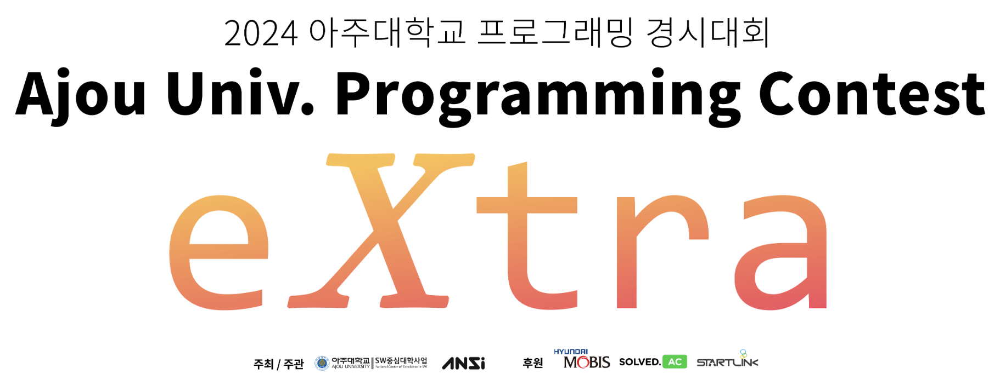
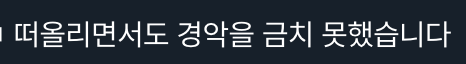

2024년 아주대학교 프로그래밍 경시대회(APC)에 extra division 이 신설되어 대회가 추가 개최되었다. 기존 APC에는 2개의 division이 존재하는데, 이번에 신설된 division은 기존 APC의 쉬운 division에 비해서도 쉬운 난이도의 대회로 기획되었다. 이번엔 참여자가 아닌 출제진이 되어 문제 출제 및 검수에 참여하였으며 이를 기념하여 대회 종료 이후 모든 문제를 풀이해보고 출제 후기를 남긴다.

## 문제풀이

(참고: 문제의 각 제목을 클릭하면 해당 문제의 BOJ 문제 화면으로 이동할 수 있다.)

### [A. 아 맞다 마늘](https://www.acmicpc.net/problem/32978)

$N$의 크기가 충분히 작기 때문에 $\mathcal{O}(N^2)$ 브루트포스를 해도 되고 아니면 재료 이름과 등장 횟수를 map 자료구조형을 사용하여 매핑해도 된다.

- 출제 당시 유행했던 흑백 요리사의 밈을 차용해서 만들어진 문제이다. [solved.ac](http://solved.ac) 기여창에도 밈과 관련한 내용들이 많다(…).

### [B. 아파트](https://www.acmicpc.net/problem/32979)

Queue를 아용하여 게임을 직접 시뮬레이트하든지, 아니면 게임을 몇번 진행하든 원형에서의 손의 순서는 바뀌지 않는다는 특성을 활용하여 최초에 주어진 손의 순서 배열에서 현재 바닥에 닿아있는 손의 인덱스를 가르키는 포인터 변수를 활용하면 된다. 

- 마찬가지로 출제 당시 한창 흥행하고 있었던 밈, [ROSÉ & Bruno Mars - APT.](https://www.youtube.com/watch?v=ekr2nIex040) 에 착안하여 만들어진 문제다.
- ~~문제에서 술냄새가 난다.~~

### [C. 분리배출](https://www.acmicpc.net/problem/32980)

어떤 쓰레기가 주어졌을때, 우선 재활용될 수 있는 대상인지 체크한다. 재활용 가능한 단일 품목으로 이루어져있어야만 재활용 가능하다고 볼 수 있다. 재활용이 가능하다면 재활용으로 버리는 비용과 일반쓰레기로 버리는 비용중 최소비용인 것을 답에 더해주고, 재활용이 불가능하다면 일반쓰레기로 버리는 비용을 답에 더해주면 된다. 쓰레기에 포함될 수 있는 품목이 7개여서, map등을 이용해 인덱스 관리를 해주면 구현이 더 쉽다.

- [sheenji](https://www.acmicpc.net/user/sheenjiwon)님이 출제한 문제인데 원래 가지고 있던 기본 아이디어에 우리가 실제로 재활용을 하는 규칙(이물질이 포함되어 있으면 재활용 대상이 아님)등과, 문자열 형태로 주어지는 쓰레기를 내가 제안했는데 받아들여져 지금의 문제가 완성되었다.

### [D. 찐 Even Number](https://www.acmicpc.net/problem/32981)

Leading zero가 허용되는 유일한 케이스인 $0$을 예외처리하면 정답은 $(4 \cdot 5^{N-1}) \mod {10^9+7}$ 임을 알 수있다. 다만 나이브하게 매 쿼리마다 거듭제곱을 구하면 TLE를 받기 때문에, 다음 두가지 전략이 유효하다.

1. 매 쿼리마다 binary exponentation으로 로그 거듭제곱을 수행한다. 시간복잡도는 $\mathcal{O}(Q \cdot \log(N))$.
2. $[1, 10^7)$ 범위의 모든 5의 거듭제곱 값을 전처리한다. 시간복잡도는 $\mathcal{O}(Q+N)$.
- 이것도 굳이 짝수가 아니라 “Even” number인 것 보니, 흑백 요리사 밈인 것 같다. 흑백 요리사 꼭 봐야겠다…

### [E. 약물 복용](https://www.acmicpc.net/problem/32982)

첫 복용을 가능한 최대한 느리게 시작하면 모든상황에서 도움이 된다는 관찰을 하면, $N$이 충분히 작기 때문에 첫 복용과 마찬가지로 가능한 선에서 복용시간을 최대한 늦추는 방향으로 그리디하게 복용시간을 선택하면 된다는 것을 알 수 있다. 다음 복용 가능 시작 시간이 마지막 복용후 약효 지속시간보다 이후라면 `NO`, 그런 경우 없이 시뮬레이션을 끝마쳤다면 `YES`를 출력하면 된다. 반열린 구간을 사용하면 구현을 더 쉽게할 수 있다.

- 아프지마세요 [dbrua1222](https://www.acmicpc.net/user/dbrua1222)…

### [F. 동굴](https://www.acmicpc.net/problem/32983)

BFS를 돌면서 각 깊이만큼만 돌았을때 모을 수 있는 루피의 총합에서 램프를 밝히는데 든 비용을 뺀값들의 최대값을 구하면 된다. BFS를 수행하면 원점으로 부터 거리가 0, 1, 2, … 순의 정점을 방문하기 때문에 깊이별 비용을 순서대로 구할 수 있다. 따라서 시간복잡도는 $\mathcal{O}(N\cdot M)$. 동굴 입구에도 수집가능한 루피가 있을 수 있음에 유의하자.

- 그래서 초록색 옷입은 애가 젤다죠?

### [G. 겨울이 좋아](https://www.acmicpc.net/problem/32984)

$[1, N]$의 모든 $i$에 대해서 $C_i=\lceil A_i/B_i\rceil$ 이라고 하자. $C_i$는 인위적인 조작을 거치지 않았을때 $i$번째 나무에 모든 나뭇잎이 떨어지는데 걸리는 일수이다. 이제 나무의 종류에 관련없이 $C$는 기본적으로 하루에 1씩 감소하며, 정우의 “특수한 능력”을 사용하면 하루에 2씩 감소시킬 수 있고, 모든 $C$를 $0$으로 만드는데 걸리는 가장 빠른 시간을 구하는 문제로 바뀌었다.

가장 큰 $C$부터 선택해서 능력을 사용하는 탐욕적인 방법이 떠올라서 사용할 수도 있겠지만, 구현이 어려울 수 있다. 대신, “$X$일 안에 주어진 $C$를 모두 0으로 만들 수 있는가?”에 대한 결정문제는 쉽게 해결할 수 있기 때문에 정답인 $X$를 이분탐색하면 된다. 결정문제는 $X$를 초과하는 모든 $C$에 대해서 특수능력을 시간안에 모두 사용할 수 있는지 여부만 체크하면 된다.

- 정우의 능력을 과대평가해 “특수한 능력”을 사용하면 $B_i$가 영구히 2배 증가되는 문제인 줄 알았다. (~~지문으로 미루어보아 “특수한 능력”은 나무 한그루를 걷어치는 능력인 것 같다…~~) 만약 영구하게 $B_i$를 2배 증가시킬 수 있다면 어떻게 문제를 해결할 수 있을까?

### [**H. 트리 부수기**](https://www.acmicpc.net/problem/32985)

XOR 연산의 가장 큰 특징중 하나는 각 자릿수에 대한 연산이 독립적으로 이루어진다는 것이다 (=bitwise independent 하다). 따라서 정답의 각 비트를 순서대로 계산해보자. $x$번째 비트는 $\bigoplus_{i=1}^{N-1} c(i,x)$ 로 계산된다. 자릿수는 최대 $2\cdot10^6$이 될 수 있으므로, 이 값을 빠르게 계산할 방법이 필요하다. 언제 $c(i,x)$가 $1$이 되는지에 집중하자.

우선 문제에서 주어진 함수 $c$의 정의대로, 트리상에서 정점 $i$를 제거해도 $x$에서 $0$으로 돌아가는 경로가 남아있으면 $c(i,x)=1$이다. 그리고 그 반대인 경우, 정점 $i$를 제거했을때, $x$에서 $0$으로 돌아가는 경로가 남아있지 않으면 $c(i,x)=0$이다. 정점 $0$을 루트로 생각했을 때, $c(i,x)=0$ 이 되기 위한 조건은 $i$가 $0$에서 $x$로 가는 경로상의 정점이 되어야 한다. 트리상에서 어떤 두 정점쌍 $(u,v)$간의 경로가 유일하다는 성질을 이용하면 이는 필요충분조건임을 쉽게 보일 수 있다. 따라서 정점쌍 $(0, x)$간 경로에서 정점 $0$을 제외한 정점 수는 $x$의 깊이 (루트인 $0$의 깊이를 $0$으로 봤을 때)라고 볼 수 있다. 위의 내용을 바탕으로 정답의 $i$번째 비트값을 계산하는 수식은 다음과 같이 정리된다:

$$
\bigoplus_{i=1}^{N-1} c(i,x)=(N-1-d_i)\mod 2
$$

선택가능한 정점수 $(N-1)$에 $c$값을 $0$으로 만드는 정점 개수인 $d_i$ ($i$의 깊이)를 제외해 $c$값을 1로 만드는 정점 개수를 2로 나눈 나머지값이다. 1자리 수에서의 XOR 연산은 법 2에서의 1자리 수 덧셈연산과 동치이기 때문에 위와 같은 표현이 가능하다.

- 개인적으로 가장 난이도 있는 문제라고 생각했다.

### [I. 나는 건포도가 싫어요](https://www.acmicpc.net/problem/32986)

다음 두가지 케이스를 고려해야한다:

1. 케이크를 적절히 잘라 모든 블록의 단면이 노출되도록 자른다. 모든 블록에 대해서 건포도의 유무성을 확인할 수 있기 때문에, 건포도의 위치를 특정할 수 있다.
2. 케이크를 적절히 잘라 한 블록을 제외한 나머지 모든 블록의 아무 단면이 노출되도록 자른다. 단면이 노출되지 않은 나머지 블록에 대해서 건포도의 유무성을 체크할 수 있고, 나머지 모든 블록에서 건포도가 관찰되지 않는다면 단면이 노출되지 않은 유일한 블록에 건포도가 위치한다고 할 수 있으므로 이 경우에도 건포도의 위치를 특정할 수 있다.

우선 모든 블록의 단면이 노출되도록 자르는 최적의 경우를 생각해보자. $X, Y, Z$ 중 가장 작은 값을 $N$ 이라고 하면, $N$ 에 해당하는 축에 수직인 평면으로 최대 두께가 2인 조각이 나오도록 식빵을 자르는 것 처럼 자르는 것이 최적이다. 이때의 최소 자르기 횟수는 $\lfloor \frac{\max(N-1,0)}{2} \rfloor$이다.

다음은 유일하게 한 블록의 단면이 노출되지 않게 자르는 방법을 사용했을 때, 위 방법보다 덜 자르는 경우가 있는지 생각해보아야 한다. 단면이 노출되지 않은 유일한 블록을 가지는 조각은 $3 \times 3 \times 3$ 형태가 유일함을 쉽게 보일 수 있다. 그런데 케이크 전체가 $3 \times 3 \times 3$ 형태인 경우를 제외하면, $3 \times 3 \times 3$ 크기의 조각으로 분할하는 경우가 최적해가 되는 경우나 유일한 최적해인 경우는 없다 (최적해여도 모든 블록의 단면이 노출되도록 자르는 방법과 같은 자르기 횟수를 가진다). 따라서 전체 케이크의 형태가 $3 \times 3 \times 3$ 이면 `0`을 출력하고 나머지 케이스들에 대해서는 위 문단의 전략이 항상 최적이다. 증명은 아래와 같다:

$3 \times 3 \times 3$ 가 아닌 다른 형태의 조각에서 $3 \times 3 \times 3$ 형태의 조각을 남기는 전략이 최적이 아님을 보여서 $3 \times 3 \times 3$ 조각을 사용할 수 있는 유일한 케이스는 $3 \times 3 \times 3$ 가 유일함을 보일 것이다.

1. $\min(X,Y,Z)\lt3$ 인 케이스
    
    $3 \times 3 \times 3$ 블록을 형성할 수 없어 고려하지 않아도 된다.
    
2. $X \times 3 \times 3$ ($X\gt3$) 케이스
    
    $3 \times 3 \times 3$ 형태의 조각을 형성하기 위해 필요한 최소 자르기 횟수는 1회이고 남은 조각들의 단면을 노출시키기 위해서 추가 자르기를 수행해야할 수 있는 반면, $3 \times 3 \times 3$ 형태를 형성하지 않는 전략에서는 $Y$ 또는 $Z$ 축에 수직한 평면으로 1번 자르면 1회에 모든 블록의 단면이 노출될 수 있어 최적이 아니다.
    
3. $X \times Y \times 3$ ($X, Y \gt 3)$ 케이스
    
    이전 케이스와 마찬가지로, $3 \times 3 \times 3$ 형태의 조각을 형성하기 위해 필요한 최소 자르기 횟수는 2회이고 남은 조각들의 단면을 노출시키기 위해서 추가 자르기를 수행해야할 수 있는 반면, $3 \times 3 \times 3$ 형태를 형성하지 않는 전략에서는 $Z$ 축에 수직한 평면으로 1번 자르면 1회에 모든 블록의 단면이 노출될 수 있어 최적이 아니다.
    
4. $X \times Y \times Z$ ($X, Y, Z \gt 3)$ 케이스
    
    $3 \times 3 \times 3$ 형태의 조각을 형성하기 위해 필요한 최소 자르기 횟수는 3회이고, 남은 조각들의 단면을 노출 시키기 위해서 추가 자르기를 수행해야할 수 있다. 일반성을 잃지 않고 $\min(X, Y, Z) = X$ 라고 가정해보자.
    
    먼저 3번의 자르기를 수행해 $3 \times 3 \times 3$ 를 케이크의 어느 한 꼭지점에 형성한다. 수행된 자르기의 결과로 생긴 남은 조각들 중  $(X-3) \times (Y-3) \times (Z-3)$ 조각에 대해서 모든 블록의 단면이 노출시키는 자르기 전략을 수행해보자. (나머지 조각들에 대해서는 우선 고려하지 않는다.)
    
    위의 전략에 따르면 필요한 자르기 횟수는 $\lfloor \frac{\max((X-3)-1,0)}{2} \rfloor$ 이고 따라서 현재까지 수행한 자르기 횟수는 $\lfloor \frac{\max((X-3)-1,0)}{2} \rfloor +3$ 이다. 전체 케이크에 대해서 모든 단면이 노출되도록 자르는 전략을 사용했을 때의 자르기 횟수는 $\lfloor \frac{\max(X-1,0)}{2} \rfloor$ 이다. 그런데 다음은 항상 성립하므로 따라서 이 경우에 $3 \times 3 \times 3$을 형성하는 경우는 최적이 아님을 알 수 있다:
    
    $$
    \lfloor \frac{\max((X-3)-1,0)}{2} \rfloor+3\geq\lfloor \frac{\max(X-1,0)}{2} \rfloor
    $$
    
    $3\times3\times3$ 조각을 케이크의 꼭지점에 형성하지 않는 경우에도 비슷한 방식으로 증명할 수 있다. 이 경우에는 $3 \times 3 \times 3$ 조각을 형성하기 위해 최소 4번에서 6번의 자르기를 수행해야 해서 “낭비되는” 자르기가 더 많다는 점에 주목해보자.
    
- 내가 출제한 문제이다. 나는 실제로 지문처럼 빵에 있는 건포도를 좋아하지 않는 편이다. 건포도의 맛이 너무 강렬해서 빵맛을 죽이기 때문에 어울리지 않는 조합이라고 생각한다. 과유불급이라고…
- 대회가 끝나고 이 문제와 관련한 후기가 몇개 올라왔다. 다들 재밌게 풀어주신 것 같아 기분이 좋다.
    
    
    
    
    
    

    
    

## 출제 후기

이때까지 문제들을 많이 풀긴 했지만, 문제를 출제해보는 것은 처음이였다. 문제 제작에 관한 프로세스는 evenharder님이 블로그에 올려두신 [프로그래밍 대회 문제를 준비하는 전문적인 방법](https://evenharder.tistory.com/1) 포스트에 아주 잘 설명이 되어 있어 참조하면 좋다.

아래는 내가 출제했던 나는 건포도가 싫어요 문제 출제 관련한 트라비아다:

- 처음 문제를 기획했을때는 $3\times3\times3$ 케이스에 대한 고려가 되어 있지 않았다. 식정리 한번만 하면 특이한 에지케이스 없는 무난한 초반난이도의 문제로 사용하는 것이 처음 문제를 만들때의 의도였다. 다만 문제 지문을 작성할때 “건포도 블록의 한면을 관찰할 수 있어야 된다”가 아니라 “건포도 블록의 위치를 특정해야한다.” 로 작성되어 [js9028](https://www.acmicpc.net/user/js9028)님이 $3\times3\times3$ 케이스와 같은 일이 발생할 수 있음을 알려주어, 위 풀이과정에 길게 적혀있는 $3\times3\times3$ 케이스를 사용해야만 최적인 경우는 케이크 크기가 $3\times3\times3$ 일때가 유일함을 증명했다. 해당 지문을 고쳐서 원래 의도된 문제로 사용할지, 그대로 두어 $3\times3\times3$ 에지케이스에 대한 내용을 추가할지 고민하다가 후자의 문제가 훨씬 흥미로운 것 같아서 예상 난이도를 조금 올리고 문제를 그대로 사용하였다.
- $3\times3\times3$ 케이스에 대한 힌트를 처음에는 문제 예제를 통해서 흘릴지 말지에 대한 논의도 있었다. $3\times3\times3$ 예제 그대로 노골적으로 주는 대신 $5\times3\times3$ → $3\times3\times3$ + $2\times3\times3$ 와 같이 분해가 된다는 식으로… [akim9905](https://www.acmicpc.net/user/akim9905)님이 그냥 이 예제를 지워버리자고 제안을 했다. 아무도 못푸는 0솔 문제가 될 것 같아서 걱정이 되었는데, 온사이트에서 다행히도 1솔이 기록되었다. 지금 돌아보니 덕분에 문제가 더 재밌어진 것 같다.
- 검수 과정에서 문제 지문에 대한 질문이 많이 들어왔다. 특히 지문 본문의 마지막 문단은 정말 많은 수정을 거쳤어야 했다. 사람들끼리 대화를 할때는 우리가 가진 맥락이 더 풍부한 경우가 많고 모호성이 있으면 그자리에서 질문을 통해 모호성을 해결할 수 있지만 문제 지문은 신문처럼 한번 발행되면 수정하기 어려운 부분이 있어서 아주 세심한 고민이 필요한 부분이라는 것을 알게 되었다. 계속 내가 쓴 지문을 읽다보니 이상한 문장도 [뇌이징](https://namu.wiki/w/%EB%87%8C%EC%9D%B4%EC%A7%95)이 되어서 말이 되는 것 처럼 보이고… peer review가 가장 절실하게 필요한 단계이다. 검수과정에서 많은 논의와 수정을 거친 결과, 다행히 문제 공개 이후 지문에 대한 질문은 없었다.

문제를 풀면서 생각해본적이 없었는데, 문제 하나를 만드는 것도 정말 품이 많이 든다는 것을 알게 되었다. 졸업전에 이런식으로 교내 대회 운영에 기여할 수 있어서 좋은 경험이였다. 내년에도 APC extra가 열릴지 말지는 모르겠지만(하반기에 열린다면 나는 없다! 하하!) 이런 난이도의 대회가 쭉 유지되어서 PS에 관심 없던 사람도 PS에 매력을 느낄 수 있는 계기가 되었으면 좋겠다. 마지막으로, 대회 준비하느라 고생하신 운영, 출제, 검수진분들 그리고 특히 참가자분들 모두 수고많으셨습니다.