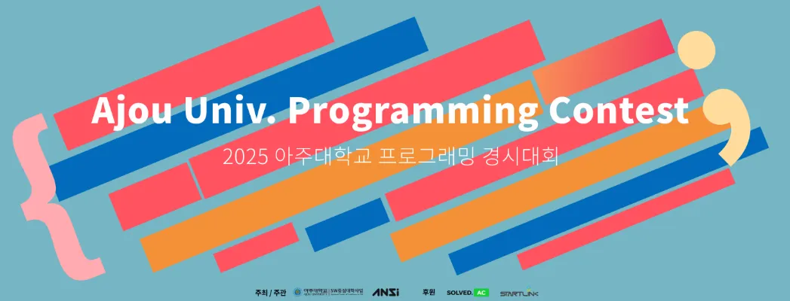
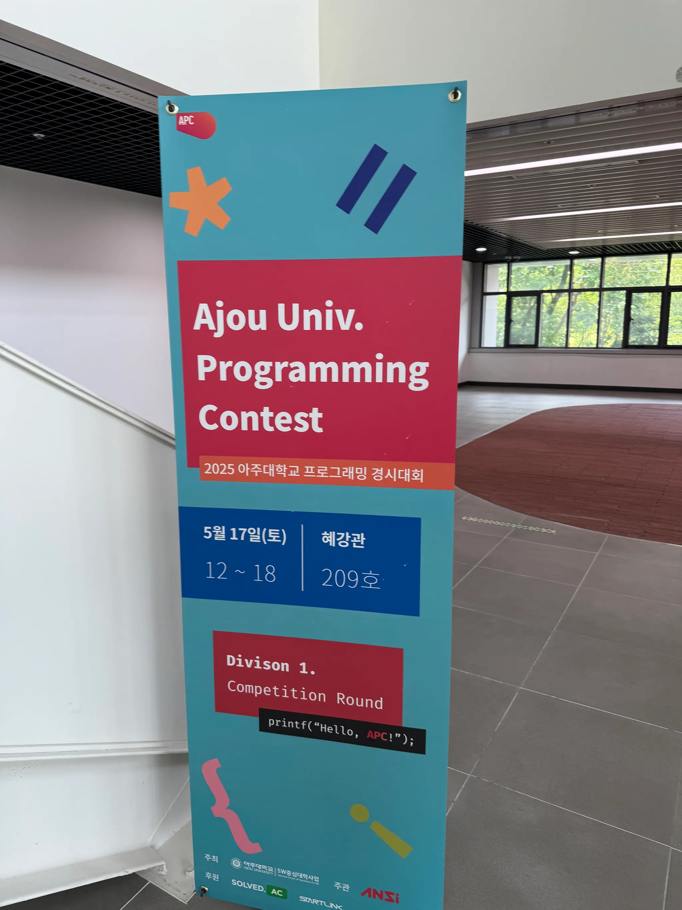

매년 개최되는 [아주대학교 프로그래밍 경시대회 APC](https://shake.codes/apc)에 출제진으로 참여하였다. 지난해에 APC의 Extra division에 출제진으로 참여했었는데([출제 후기](https://sylvesterkwon.com/problem-solving/apc-2024-extra/)), 일회성에 그치는 Extra divison과 다르게 본 대회는 올해로 15회를 맞이하는 유서깊은 교내 대회이다.

2023년도에는 이 대회에서 수상을 하기도 했었는데 ([참여 후기](https://sylvesterkwon.com/problem-solving/apc-2023-div1/)), 같은 대회에 출제진으로 참여할 수 있어서, 그리고 PS 관련해선 아마 마지막 활동이 될 것 같아 그 의미가 깊어 출제했던 문제들을 풀이하고, 감상을 남긴다.

## 문제 풀이

출제된 총 13개의 문제중 3문제를 출제하였다.

### [-/2A. Acentuación del idioma español](https://www.acmicpc.net/problem/33883)

어려울 것 없이 조건문을 사용하여 지문에서 요구하는 “규칙적 강세” 규칙을 구현해서 강세가 적용되는 모음이 있다면 해당 모음의 위치를, 없다면 `-1`을 출력하면 된다.

- 지문에 “불규칙적 강세” 규칙에 대한 서술이 있지만, 문제 풀이에 있어서는 신경쓰지 않아도 된다. 원래는 해당 규칙도 문제에 포함시키려고 했으나, 악센트 표시가 붙은 모음(`á`, `é`, `í`, `ó`, `ú`)은 보편적인 ASCII가 아닌 UTF-8 인코딩등을 사용해야 한다는 것을 알게 되어 문제에서 제외하게 되었다.
- 2024 ICPC 자카르타 리저널에서 내가 많이 고전했던 문제 [A. Scrambled Scrabble](https://www.acmicpc.net/problem/33119)에서 나왔던 자음과 모음을 활용한 문제 지문, 그리고 지난학기에 스페인어를 수강하면서 배웠던 내용에서 영감을 받아 만들었다.

### [1A/2C. 마지막 수강신청](https://www.acmicpc.net/problem/33885)

수강할 과목 집합을 $S$라고 하자. $S$를 구성할 수 있는 경우의 수는 최대 $2^N$이다. 여기서 $N$ 제한이 최대 $10$이기 때문에 경우의 수는 최대 $1024$가지 밖에 되지 않는다는 점에 주목하자. 가능한 모든 $S$에 대해 현재 $S$에 속한 다른 강의들끼리 시간이 겹치는 경우가 없는지, 요구되는 수강 학점 $M$을 채울 수 있는지 확인하면 된다. 한가지 조합으로라도 두 조건을 만족한다면 `YES`, 두 조건을 만족하는 조합이 한가지도 없다면 `NO`를 출력하면 된다.

모든 $S$에 대한 순회는 백트래킹 또는 완전탐색으로 수행할 수 있다. 시간 겹치는 경우에 대한 확인은 $5 \cdot 24$칸의 배열을 통해 확인할 수 있다.

- 지문에 등장하는 도현이는 나다. 정말 마지막 학기에 만든 실화에 기반한 문제다.
- 에브리타임의 “시간표 마법사” 기능에서 영감을 받았다. 원 기능에서는 그룹이 여러개가 있고, 그룹에 과목을 담아 그룹에서 1개씩 꺼내서 모든 경우의 수를 살펴본 후 만들 수 있는 시간표를 제공하는 기능이다.
- 보통 PS문제가 현실세계의 문제와 동떨어있는 경우가 많은데, Div. 1의 가장 쉬운 문제로 포지셔닝하여 기획한 만큼 조금이라도 연관있는 문제를 만들어야 겠다 싶어 출제하게된 문제이다.션해서 기획한 문제라서 어느정도 현실과 맞닿아있는, 실제로 한번쯤 생각해봤을법한 문제를 생각하다 시간표 기능 구현 문제를 출제하게 되었다.
- 기존에는 강의 시간도 현실적으로 분단위 입력을 주려고 했었는데, 난이도 상의 이유로 시간단위 입력만 고려하도록 조정되었다.

### [1E/-. 공중화장실 공리주의](https://www.acmicpc.net/problem/33889)

모든 사람이 이웃하는 사람 없이 화장실을 이용할 수 있는 경우와 그렇지 않은 경우를 케이스워크 해보자.

1. $M\leq \left\lceil \frac{N}{2} \right\rceil$ 을 만족하는 경우
    
    이 경우에는 모두가 심리적 안정감 $2$를 가질 수 있다.
    
    이 경우에는 어느 누구도 다른 사람과 이웃한 칸을 점유하지 않는다. 어느 누구도 이웃하지 않아야 하기 때문에, 모든 인원을 우선 다음과 같이 배치합한다 ($O$는 사람이 있는 칸, $X$는 빈칸):
    
    $$
    \underbrace{O, X, O, ..., X, O}_{2\cdot M-1}
    $$
    
    발상의 전환을 해서, 위 배치에서의 $O$ 사이의 공간 $M+1$개에 남아있는 화장실 칸 $N-(2\cdot M-1)$개를 "끼워넣어"보자. 이 경우의 수를 구하는 것은 중복조합 문제이며, 다음과 같이 정리할 수 있다:
    
    $$
    _{M+1}\mathrm{H}_{N-2\cdot M+1} =  _{N-M+1}\mathrm{C}_{N-2\cdot M+1}
    $$
    
2. $M> \left\lceil \frac{N}{2} \right\rceil$ 인 경우
    
    앞선 경우와 다르게 모두가 심리적 안정감 $2$를 가질 수는 없다. 이웃해있는 사람들을 하나의 그룹으로 생각해보자, 한 그룹에서의 심리적 안정감 합은 $2$이다. 따라서 그룹의 개수를 최대화하는 문제는 심리적 안정감의 총합을 최대화 하는 문제와 동치라고 볼 수 있다.
    
    마찬가지로 발상의 전환을 해서(발상의 전환이라기 보다는 조합론적인 직관?) 우선 다음과 같이 사람 $M$명을 모두 이어서 배치하고 (그룹이 $1$개인 상황),  $X$를 $O$사이의 공간에 삽입하여 그룹의 개수를 최대화 하는 문제로 바꿔보자.
    
    $$
    \underbrace{O, O, O, ..., O}_{M}
    $$
    
    생각해보면 양 끝 공간이나, 같은 공간에 여러개의 $X$를 끼워 넣는 것은 그룹의 개수를 최대화 하는데 도움이 되지 않는다. 따라서 $O$ 사이의 유효한 공간 $M-1$개 중, "중복을 허용하지 않고" $N-M$ 개의 $X$를 삽입하는 경우의 수를 구하는 문제가 된다. 이는 다음과 같다:
    
    $$
    _{M-1}\mathrm{C}_{N-M}
    $$
    

$N$ 제한이 충분히 작기 때문에, 이항계수 점화식 ($_{n}\mathrm{C}_{r} = _{n-1}\mathrm{C}_{r} + _{n-1}\mathrm{C}_{r-1}$)을 이용해 DP를 한다면 문제풀이에 필요한 범위의 모든 이항계수를 전처리할 수 있다. 이때 전처리에 필요한 시간 복잡도는 $\mathcal{O}({N^2})$.

- 원래 의도했던 문제는 $N$ 제한이 $10^5$이다. 페르마 소정리를 통한 이항계수 계산 ($_{n}\mathrm{C}_{r}\equiv\frac{n!}{r!(n-r)!}\equiv n!\cdot (n-k)^{p-2} \cdot k^{p-2} \pmod{p}$)을 통한 풀이를 유도하려고 했었는데, 난이도 커브 구성을 위해 마찬가지로 난이도가 일부 타협되었다. 이 방법을 사용한다면 시간 복잡도는 $\mathcal{O}(N \log{p})$.
- 문제 지문은 다소 비위생적(?)인데, 평소에 공중 화장실을 이용하면서 지문에 있는대로 최대한 옆칸을 비우는 컨벤션을 불문률처럼 지키고 있는 사람들을 보면서 흥미롭다고 생각했고, 문제 아이디어를 고민하다가 경우의 수를 구하는 문제를 만들어보면 재밌을 것 같아서 출제된 문제이다. 나만 이 문제에 대해서 심각하게 생각해본 것은 아닌지 [Reddit에 관련 meme](https://www.reddit.com/r/ComedyCemetery/comments/8igs1s/only_guys_will_understand/)도 있다.
    
    <figure style="display:block; width:50%; margin-left:auto; margin-right:auto;">
        
        <figcaption>1수 체크메이트 상황(...)</figcaption>
    </figure>
    

## 이모저모

- 아주대학교 소프트웨어학과 졸업 요건중 하나로 TOPCIT 특정 점수 이상 득점 혹은 APC수상 조건이 걸려있었는데, 금년부터 APC에서 1문제만 풀면 해당 조건을 만족시킬 수 있게 되었다. 공교롭게도 내가 출제했던 “마지막 수강신청” 문제가 Div. 1에서 가장 쉬운 문제가 되었고 (우연히 지문도 졸업 관련 지문이다…) 내가 만든 문제로 누군가의 졸업 요건이 충족된다고 생각하니 기분이 아주 묘했다.
- 본대회가 끝나고 출제진들은 각자 출제한 문제에 대한 풀이를 발표하게 된다. 전혀 웃음 포인트가 아니라고 생각했는데 첫번째 문제인 “Acentuación del idioma español” 문제의 이름을 발음하자 웃어주시는 분들이 계셨다. 보통 많은 사람들 앞에서 서서 말하면 덜덜 떨면서 말하는데 덕분에 편하게 발표할 수 있었다.
- 위의 문제별 출제 후기를 보면 알겠지만, 예쁜(?) 난이도 구성을 가진 대회를 만들기 위해서 일부 조정된 문제들이 있다. 선제 단계에서 출제진들이 정말 재밌는 아이디어를 많이 가져왔는데 조금 아쉬웠던 부분이 있다. 그런데 지금 생각해보면 난이도 구성도 중요했지만, 교내 대회라는 특성상 어떤 한 문제를 풀기 위해 최고의 방법(가령, 페르마 소정리)만을 허용하는 대신 여러 풀이에 대해 문제를 열어놓고, 문제를 “도전할만하게” 설계한 다음 더 나은 해결책을 스스로 찾아서 공부하게 할 수 있다는 측면에서도 문제 제한을 낮추자는 의견은 좋은 아이디어였던 것 같다. (“공중화장실 공리주의” 문제에서도 왜 $N$ 제한이 통상적인 이항계수 문제와 다르게 $10^5$ 이 아닌지 물어보는 사람이 있었는데, 내가 의도한 것은 조합론적인 사고에서 오는 즐거움이였지, 페르마 소정리를 알고있는지 여부를 확인하려던 것은 아니였기 때문에 더더욱…)
- 테스트케이스 구성에 정말 많은 어려움을 겪었다. 좋은 테스트케이스를 만드는 것은 문제 자체의 난이도와 상관관계가 크게 없는 것을 뼈저리게 느낀다. 특히 “마지막 수강신청”문제의 테스트케이스를 구성하는 것은 임의로 임의 갯수의 연결요소가 있는 + 문제 조건에 맞는 제약 조건이 있는 그래프를 구성하는 문제였다. 힘들게 제네레이터를 작성하고 테스트케이스를 구성해도 검수 과정에서 계속 저격 케이스가 발견되어 보강했어야 했다. 갑자기 든 감상인데, 문제를 만드시는 분들이 평소에 얼마나 많이 고생하시는지 생각하게 되었다. 항상 저격 코드에 대해서 생각해야하고 기타 등등… 오래 하면 숙련될 수 있는 부분이긴 하겠지만서도 말이다. 이때까지 양질의 문제를 무료로 온라인에서 풀 수 있었음에 무한한 감사를 느낀다.

## 끝맺으며

<figure style="display:block; width:50%; margin-left:auto; margin-right:auto;">
  
  <figcaption>혜강관에서 진행되었던 APC 2025</figcaption>
</figure>

지난 Extra때는 여행일정에 겹쳐서 안타깝게도 대회장에 방문하지 못했는데, 이번엔 대회장에 참석해서 열심히 문제 푸는 참가자들도 볼 수 있어서 좋았다. 단, 참가자 수는 눈에 띄게 줄었다는 부분이 조금 슬프다. ChatGPT와 같은 LLM의 등장으로 PS판 분위기도 안좋고, 채용 과정에서도 PS비중이 조금씩 줄고 있어서 그 인기가 예전만 못함을 느낀다. 이는 개회사를 맡아주신 교수님도 언급하신 부분이다.

PS 무용론과 관련해서 어느정도 맞는 말도 있지만, PS에서 사용하는 “문제 이해-해법 탐색-구현” 프레임워크는 여전히 소프트웨어 개발 전반에 필요한 핵심역량이라고 생각하고, 여전히 그것을 갈고 닦는데 PS만한 것이 없다는 생각이다. 그래서 요즘 분위기가 많이 흉흉하긴 하지만 앞으로도 APC와 같은 대회가 계속 개최되고, 참가자들도 더 많아졌으면 좋겠다.

마지막으로 이번 대회에 아주대에서 PS에 깊은 애정을 가진 고수분들과 함께 출제진으로 참여해볼 수 있어 뜻깊었다. 이분들의 PS에 대한 열정과 책임감에 많은 자극을 받았다. 또한, 검수진 분들도 좋은 검수의견 많이 주셔서 많은 도움을 받았었다. 좋은 경험이였다.